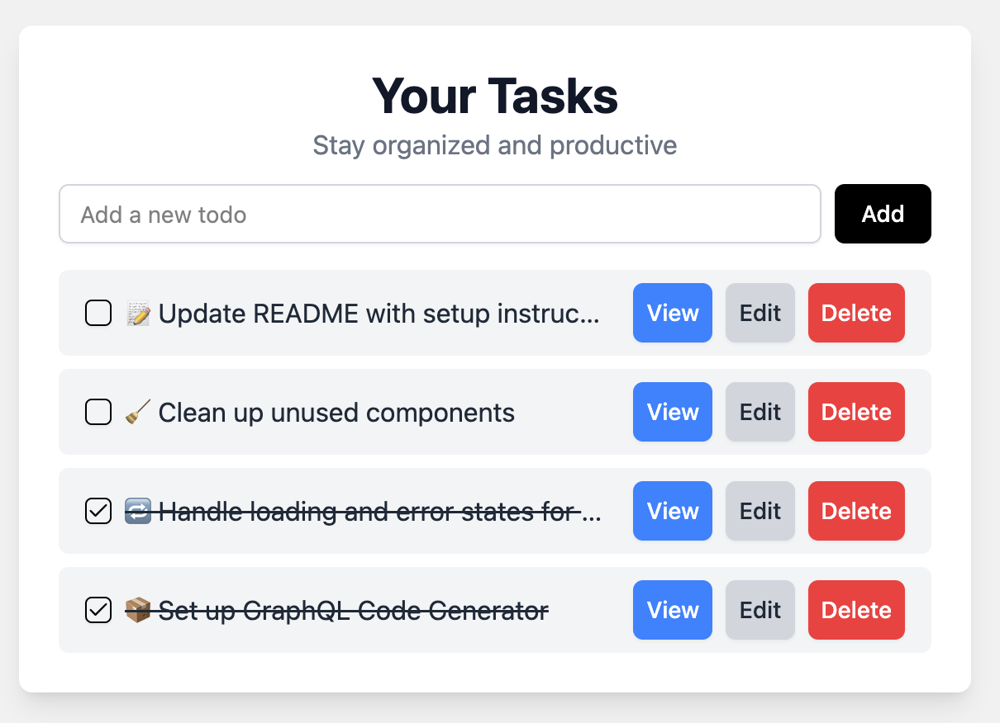

```markdown
# 🧩 Full-Stack GraphQL To-Do List App

A modern full-stack To-Do list application built using:

- 🔮 Frontend: React with Apollo Client + TypeScript + Vite + GrahphQL
- 🧠 Backend: NestJS with Apollo Server + TypeScript (GraphQL Code-First)
- 🎯 Codegen: GraphQL Code Generator for auto-updated TypeScript types

---

## 🛠️ Tech Stack

| Layer       | Technology                     |
|-------------|--------------------------------|
| Frontend    | React, Apollo Client |
| Backend     | NestJS, Apollo Server (Code First) |
| Tooling     | GraphQL Code Generator, UUID |
| Language    | TypeScript |
| Dev Tools   | Apollo GraphQL  Sandbox Playground

---

## 🚀 Features

- Create, read, update, and delete to-dos using GraphQL
- Typed GraphQL queries and mutations using `@graphql-codegen`
- Reusable GraphQL fragments for consistency
- Auto-generated TypeScript types from your GraphQL schema and documents
- Proper resolver typings in the backend for type safety

---

## ⚙️ Setup Instructions

### Prerequisites

- Node.js v20+
- npm
- Docker (for database layer if needed in future)

### Backend (NestJS + GraphQL)

```bash
cd server
npm install
npm run start:dev

```

Navigate to: [http://localhost:3001/graphql](http://localhost:3001/graphql)

### Frontend (React + Apollo)

```bash
cd client
npm install
npm run dev

```

Navigate to: [http://localhost:5173](http://localhost:5173/)

----------

## 📦 GraphQL Codegen Setup

> Ensures TypeScript types stay in sync with your schema and queries.

### Run code generation

```bash
npm run codegen

```

-   Changes in GraphQL operations automatically update `.ts` types in folder graphql-client.
    
-   If you remove a field in a fragment or query, the corresponding TypeScript field will be removed as well and will trow error id any attribute has been removed from query using below command.

```bash
npm run gen:watch
```

    
    

**Codegen Config (client side):**

```ts
// codegen.ts
import type { CodegenConfig } from "@graphql-codegen/cli";

const config: CodegenConfig = {
  overwrite: true,
  schema: "http://localhost:3001/graphql",
  documents: ["src/graphql/**/*.ts"],
  generates: {
    ["./src/graphql-client/types.d.ts"]: {
      plugins: [
        "typescript",
        "typescript-operations",
        "typescript-react-apollo",
      ],
    },
    ["./src/introspection-result.json"]: {
      plugins: ["fragment-matcher", "introspection"],
    },
  },
};

export default config;

```

----------

## 🧠 GraphQL Best Practices Used

### ✅ Fragment Usage

We created a reusable fragment for todo fields:

```graphql
fragment TodoFields on Todo {
  id
  title
  isCompleted
}

```

This fragment is reused in multiple queries and mutations to ensure consistency and reduce duplication.

### ✅ Type Safety

-   Both client and server are written in TypeScript.
    
-   All resolvers in the backend are strongly typed.
    
-   GraphQL Code Generator ensures query/mutation results are strictly typed.
    

### 🚫 Anti-Patterns Avoided


| **Anti-Pattern**         | **How We Avoided It**                             |
|--------------------------|----------------------------------------------------|
| Over-fetching            | Queries only request the required fields           |
| Under-fetching           | Reused fragments to include necessary data         |
| Manual typing            | Used codegen to generate TS types                  |
| Inconsistent schema use  | Shared fragments across queries/mutations          |


----------

## 📂 Folder Structure Overview

```
├── client/
│	├── src/
│	│   ├── assets/
│	│   ├── components/
│	│   │   ├── ui/
│	│   │   │   ├── badge.tsx
│	│   │   │   ├── button.tsx
│	│   │   │   ├── checkbox.tsx
│	│   │   │   └── input.tsx
│	│   │   ├── AddToDo.tsx
│	│   │   ├── ErrorState.tsx
│	│   │   ├── Spinner.tsx
│	│   │   ├── TodoItem.tsx
│	│   │   ├── TodoList.tsx
│	│   │   └── ViewTodo.tsx
│	│   ├── graphql/
│	│   │   ├── fragments.ts
│	│   │   ├── mutations.ts
│	│   │   └── queries.ts
│	│   ├── graphql-client/
│	│   │   └── types.d.ts
│	│   ├── lib/
│	│   ├── types/
│	│   ├── App.css
│	│   ├── App.tsx
│	│   ├── index.css
│	│   ├── introspection-result.json
│	│   └── main.tsx
│	├── .gitignore
│	├── codegen.ts
│	├── components.json
│	├── eslint.config.js
│	├── index.html
│	├── package-lock.json
│	├── package.json
│	├── README.md
│	├── tsconfig.app.json
│	├── tsconfig.json
│	├── tsconfig.node.json
│	└── vite.config.ts


├── server/
│	├── dist/
│	├── node_modules/
│	├── src/
│	│   ├── app.module.ts
│	│   ├── main.ts
│	│   ├── common/
│	│   └── todo/
│	│       ├── dto/
│	│       │   ├── create-todo.input.ts
│	│       │   └── update-todo.input.ts
│	│       ├── models/
│	│       │   └── todo.model.ts
│	│       ├── todo.module.ts
│	│       ├── todo.resolver.spec.ts
│	│       ├── todo.resolver.ts
│	│       ├── todo.service.spec.ts
│	│       └── todo.service.ts
│	├── .gitignore
│	├── eslint.config.mjs
│	├── jest.config.ts
│	├── nest-cli.json
│	├── package.json
│	├── package-lock.json
│	├── README.md
│	├── schema.gql
│	├── tsconfig.build.json
│	├── tsconfig.json
│	└── tsconfig.spec.json


```

----------

## 📮 Sample Queries

### ✅ CREATE TODO

**Operation:**

```graphql
mutation CreateTodo($createTodoInput: CreateTodoInput!) {
  createTodo(createTodoInput: $createTodoInput) {
    id
    isCompleted
    title
  }
}

```

**Variables:**

```json
{
  "createTodoInput": {
    "title": "Write unit tests for user service"
  }
}

```

----------

### 📋 GET ALL TODOS

**Query:**

```graphql
query GetAllTodos {
  getAllTodos {
    id
    isCompleted
    title
  }
}

```

----------

### 🔍 GET TODO BY ID

**Operation:**

```graphql
query GetTodoById($getTodoByIdId: String!) {
  getTodoById(id: $getTodoByIdId) {
    id
    isCompleted
    title
  }
}

```

**Variables:**

```json
{
  "getTodoByIdId": "PASTE TODO ID HERE"
}

```

----------

### ✏️ UPDATE TODO BY ID

**Operation:**

```graphql
mutation UpdateTodo($updateTodoId: String!, $update: UpdateTodoInput!) {
  updateTodo(id: $updateTodoId, update: $update) {
    id
    isCompleted
    title
  }
}

```

**Variables:**

```json
{
  "updateTodoId": "PASTE TODO ID HERE",
  "update": {
    "title": "Refactor authentication logic"
  }
}

```

----------

### ❌ DELETE TODO BY ID

**Operation:**

```graphql
mutation DeleteTodo($deleteTodoId: String!) {
  deleteTodo(id: $deleteTodoId)
}

```

**Variables:**

```json
{
  "deleteTodoId": "PASTE TODO ID HERE"
}

```


