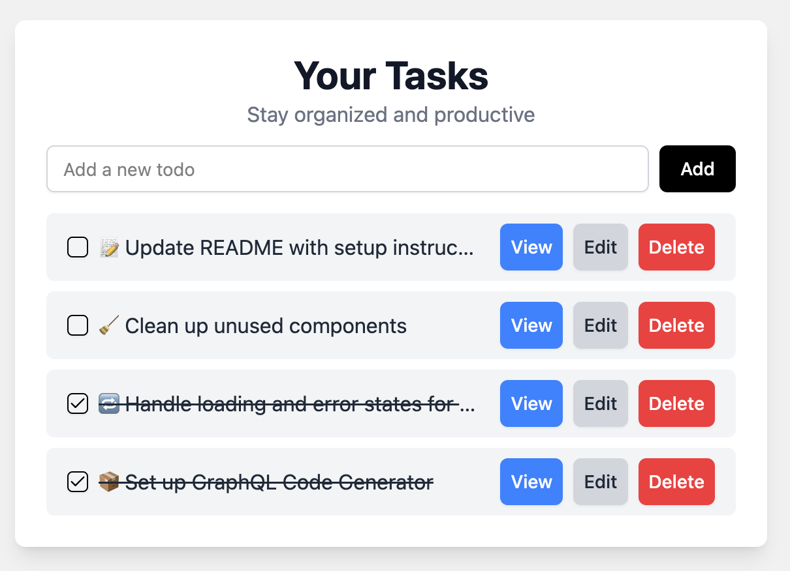

# 📝 To-Do List  React + Apollo Client + TypeScript + Vite + GraphQL


---

## ⚙️ Setup

**Node version should be 20.x**

Install dependencies and start the development server:

```bash
npm install
npm run dev

```

Once the server is running, open below endpoint:

[http://localhost:5173](http://localhost:5173)


