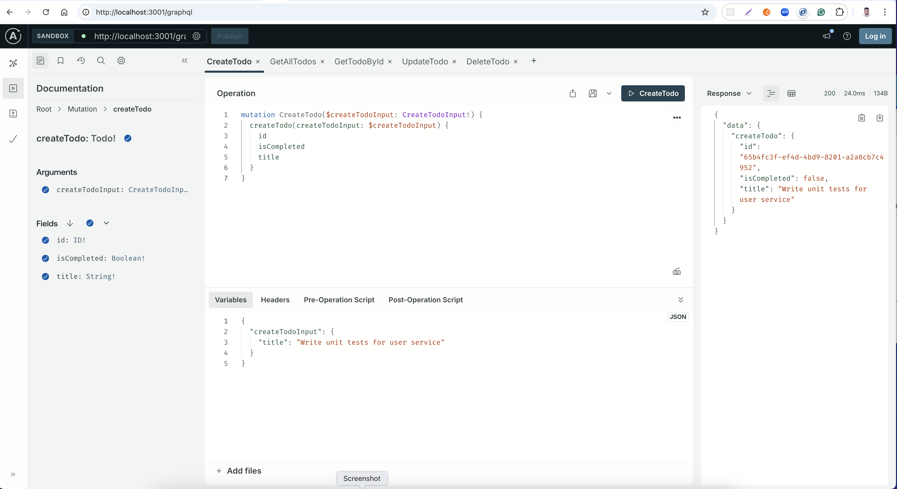

# 📝 To-Do List  NestJS, Apollo Server, TypeScript and GraphQL

A simple GraphQL To-Do List application built with **NestJS** and **Apollo Server**.

---

## ⚙️ Setup

**Node version should be 20.x**

Install dependencies and start the development server:

```bash
npm install
npm run start:dev

```

Once the server is running, open GraphQL Playground:

[http://localhost:3001/graphql](http://localhost:3001/graphql)

----------

## 🔧 GraphQL Operations

### ✅ CREATE TODO

**Operation:**

```graphql
mutation CreateTodo($createTodoInput: CreateTodoInput!) {
  createTodo(createTodoInput: $createTodoInput) {
    id
    isCompleted
    title
  }
}

```

**Variables:**

```json
{
  "createTodoInput": {
    "title": "Write unit tests for user service"
  }
}

```

----------

### 📋 GET ALL TODOS

**Query:**

```graphql
query GetAllTodos {
  getAllTodos {
    id
    isCompleted
    title
  }
}

```

----------

### 🔍 GET TODO BY ID

**Operation:**

```graphql
query GetTodoById($getTodoByIdId: String!) {
  getTodoById(id: $getTodoByIdId) {
    id
    isCompleted
    title
  }
}

```

**Variables:**

```json
{
  "getTodoByIdId": "PASTE TODO ID HERE"
}

```

----------

### ✏️ UPDATE TODO BY ID

**Operation:**

```graphql
mutation UpdateTodo($updateTodoId: String!, $update: UpdateTodoInput!) {
  updateTodo(id: $updateTodoId, update: $update) {
    id
    isCompleted
    title
  }
}

```

**Variables:**

```json
{
  "updateTodoId": "PASTE TODO ID HERE",
  "update": {
    "title": "Refactor authentication logic"
  }
}

```

----------

### ❌ DELETE TODO BY ID

**Operation:**

```graphql
mutation DeleteTodo($deleteTodoId: String!) {
  deleteTodo(id: $deleteTodoId)
}

```

**Variables:**

```json
{
  "deleteTodoId": "PASTE TODO ID HERE"
}

```



